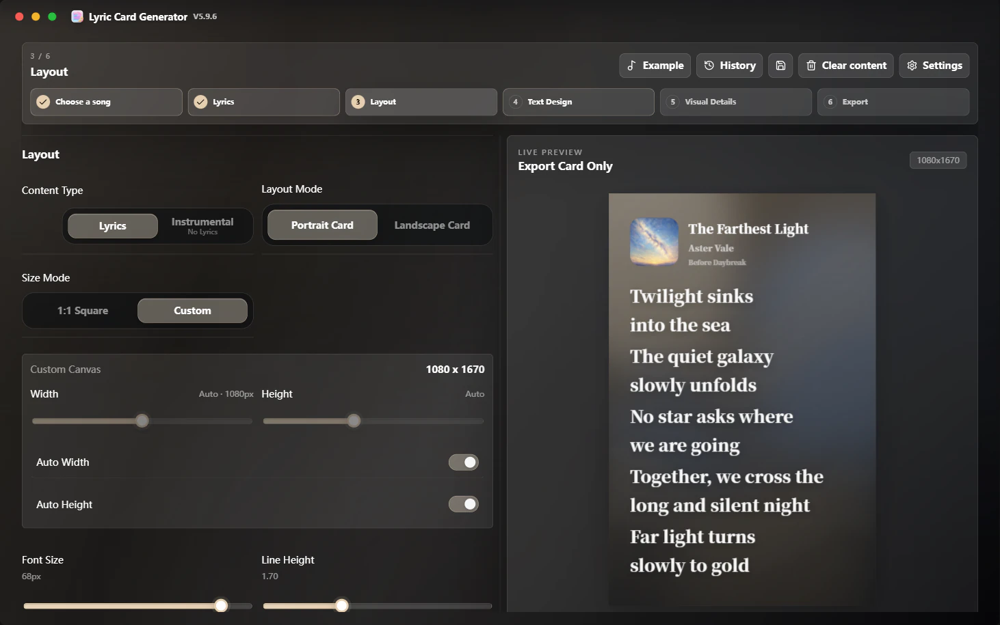
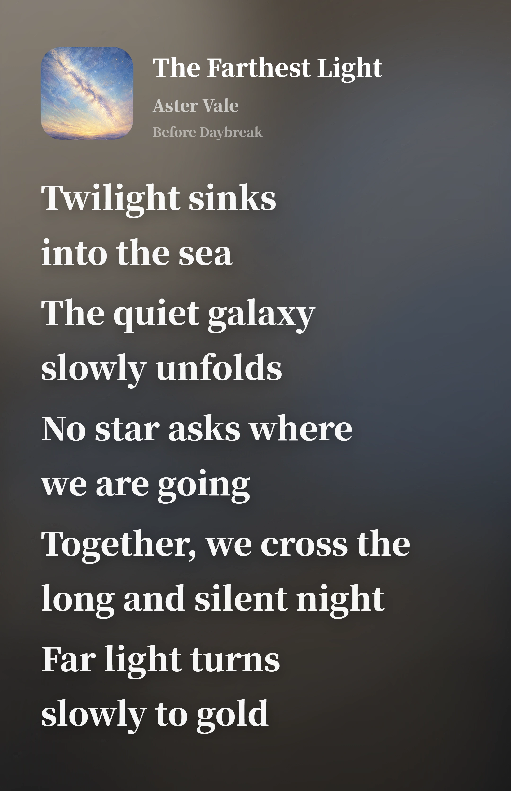
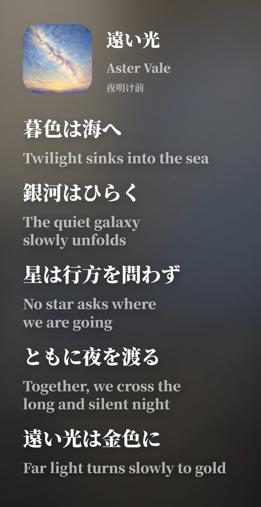

# 🎧 Lyrics Card Generator

### Generate polished lyric sharing cards for social sharing

**Spotify / Apple Music / NetEase Cloud Music / QQ Music · Windows desktop app · HD PNG / WebP / JPG export · multilingual documentation**

  <strong>Language</strong> 
  <a href="./README.md">简体中文</a> ·
  <a href="./README.zh-TW.md">繁體中文</a> ·
  <strong>English</strong> ·
  <a href="./README.fr.md">Français</a> ·
  <a href="./README.ja.md">日本語</a> ·
  <a href="./README.es.md">Español</a>

  <strong>Navigation</strong> 
  <a href="https://github.com/Qrzzzz/lyrics-card-generator/releases/latest">Latest Release</a> ·
  <a href="./docs/releases/v6.2.4.en.md">Release Notes</a> ·
  <a href="https://qrzzzz.github.io/lyrics-card-generator/">Online Web Lite</a> ·
  <a href="./docs/web-lite-browser-support.md">Web Lite Browser Support</a> ·
  <a href="#features">Features</a> ·
  <a href="./docs/development.en.md">Local Development</a> ·
  <a href="./LICENSE">License</a>

---

<strong>🖥️ App interface</strong>

<table>
  <tr>
    <td align="center" valign="top"> <b>Step 3: Layout · Dynamic colors from the album cover</b></td>
  </tr>
</table>

<strong>✨ Output examples</strong>

<table>
  <tr>
    <td width="50%" align="center" valign="top"><b>Without translation · English</b> </td>
    <td width="50%" align="center" valign="top"><b>With translation · Japanese original + English translation</b> </td>
  </tr>
</table>

Both images were exported directly from the app with automatic width, automatic height, and a 1.7 line height.

A Windows desktop app for creating lyric sharing cards.
Paste a song link or enter song information manually, edit lyrics, translations, cover art, and visual styles, then export a high-resolution PNG, WebP, or JPG image for sharing.

## 📦 Download and Installation

v6.2.4 is released and available from [GitHub Releases](https://github.com/Qrzzzz/lyrics-card-generator/releases/latest):

* Windows x64 installer: `Lyrics.Card.Generator.Setup.6.2.4.exe`

Starting with v6.2.2, Windows x64 Setup is the only distributed desktop package.

> The current build is not code-signed. Windows may show a SmartScreen warning, which is common for unsigned personal applications.

### v6.2.4 Highlights

* The settings system is reorganized by actual scope across new-card footer defaults, file export, AI connection and translation, history, and storage.
* Settings and AI save failures now remain globally visible with retry support; footer defaults apply only to newly created cards instead of overwriting the current document.
* This release adds a safe AI connection test, a no-retention option for automatic history, scoped preference reset, font validation, offline license links, and accessibility improvements.

## 🌐 Multilingual Release Notes

GitHub Release displays a Simplified Chinese summary by default. See the full release notes:
[简体中文](./docs/releases/v6.2.4.zh-CN.md) · [繁體中文](./docs/releases/v6.2.4.zh-TW.md) · [English](./docs/releases/v6.2.4.en.md) · [Français](./docs/releases/v6.2.4.fr.md) · [日本語](./docs/releases/v6.2.4.ja.md) · [Español](./docs/releases/v6.2.4.es.md)

## ✨ Features

### 🎨 Image Generation & Canvas Layout

* Generate high-polish lyric sharing images
* Portrait size modes plus free-ratio landscape cards with automatic or manual lyrics-region width and requested height
* Content-driven landscape planning for the cover/metadata left column and lyrics-only right column, without cropping lyrics or artwork
* Measured auto width and auto height for portrait custom canvases
* High-resolution PNG, WebP, and JPG export
* Direct high-quality PNG copy to the system clipboard

### 📝 Lyrics Layout & Translation

* Original lyric and translation layout
* Keep only an exact selection from either column, with undo and redo support
* Split alternating original / translated lyrics with Simplified Chinese, Traditional Chinese, English, French, Japanese, and Spanish target-language detection
* AI lyric translation through OpenAI-compatible Chat Completions APIs, with configurable provider URL, model, API key, six default presets, up to two custom presets, reasoning, and streaming output

### 🎵 Song Search, Music Links & Local File Parsing

* Search NetEase Cloud Music by title, artist, or album, then import metadata and lyrics from a selected result
* Spotify, Apple Music, NetEase Cloud Music, and QQ Music link parsing
* Local MP3 / FLAC / M4A metadata parsing for title, artist, album, cover art, and embedded lyrics

### ✍️ Manual Editing & Material Upload

* Manual song title, artist, cover, and lyric editing
* Local cover upload

### 🌈 Visual Style & Brand Info

* Palette extraction from cover art for gradient backgrounds
* App interface appearance modes: Album dynamic, Dark, Light, Dark Acrylic, and Light Acrylic
* Platform logo, shared-by text, and generated watermark

### 🔤 Fonts & Multilingual Interface

* Source Han Sans / Serif schemes, independent CJK and Latin fonts, a system-font picker, and lyric-based typography previews
* Simplified Chinese / Traditional Chinese / English / French / Japanese / Spanish interface

### 🚀 Version Updates

* GitHub Releases update checking

### 🪟 Windows Desktop

* Electron wraps the Next.js interface and local API. The EXE starts its bundled service on a dynamic `127.0.0.1` port, so users do not need Node.js
* Offline startup supports manual editing, local covers, local MP3 / FLAC / M4A parsing, styling, and PNG / WebP / JPG export
* Music-platform links, NetEase Cloud Music search, remote covers and lyrics, AI translation, and GitHub update checks require a network connection
* Maintainers can use the [desktop maintenance guide](./docs/desktop.md); setup, testing, and packaging commands are in the [development guide](./docs/development.en.md)

## 🙏 Acknowledgements

Thanks to [Apple Music](https://music.apple.com/). The colorful gradients, flowing-light background aesthetics, and early lyric card layout direction in this project were inspired by the Apple Music visual experience. This project is not affiliated with Apple Music and does not represent Apple Music’s official position.

Thanks to [Source Han Sans](https://github.com/adobe-fonts/source-han-sans) and [Source Han Serif](https://github.com/adobe-fonts/source-han-serif). They provide a stable, clear, and substantial typographic foundation for Chinese lyric cards.

Thanks to [OpenAI Codex](https://openai.com/codex/). It turned many scattered ideas into runnable code, desktop build workflows, and real features.

Thanks to [ChatGPT 5.6 Sol](https://chatgpt.com/) for issue diagnosis, solution design, fix review, and acceptance checks throughout development.

Thanks to [ReactBits](https://www.reactbits.dev/) for multiple UI ideas, including motion inspiration such as Spark Cursor.

Thanks to [Rangerov](https://github.com/rangerov0716) for attention to this project and for providing feedback.

Thanks to [V0idream](https://github.com/V0idream) for suggesting code slimming improvements. [`v1.1.0`](https://github.com/Qrzzzz/lyrics-card-generator/releases/tag/v1.1.0) has already made related optimizations accordingly.

Thanks to the following songs and their creators. They serve as project samples, helping verify how lyric cards appear across different languages, fonts, translation lengths, and layout rhythms.

Expand to see song samples

| Song | Album | Artist |
| --- | --- | --- |
| 《opposite》 | *emails i can't send fwd:* | [Sabrina Carpenter](https://www.sabrinacarpenter.com/) |
| 《勇者》 | *THE BOOK 3* | [YOASOBI](https://www.yoasobi-music.jp/) |
| 《光辉岁月》 | *命运派对* | [Beyond](https://music.apple.com/cn/artist/beyond/79668659) |
| 《Opalite》 | *The Life of a Showgirl* | [Taylor Swift](https://www.taylorswift.com/) |
| 《honeybee》 | *you seem pretty sad for a girl so in love* | [Olivia Rodrigo](https://www.oliviarodrigo.com/) |
| 《Lies》 | *Always - EP* | [BIGBANG](https://ygfamily.com/en/artists/bigbang/discography) |

Thanks also to these open-source projects and their maintainers: [Next.js](https://nextjs.org/), [React](https://react.dev/), [TypeScript](https://www.typescriptlang.org/), [Tailwind CSS](https://tailwindcss.com/), [Electron](https://www.electronjs.org/), [electron-builder](https://www.electron.build/), [html-to-image](https://github.com/bubkoo/html-to-image), [Framer Motion](https://motion.dev/), [Lucide React](https://lucide.dev/), [Cheerio](https://cheerio.js.org/), [Zod](https://zod.dev/), and the many toolchains that make up the modern frontend ecosystem. Without this infrastructure, this project would not exist in its current form.

## 📄 License

This project is released under a custom Source Available License, not a traditional open-source license.

You may view, download, run, and privately modify the source code for personal, non-commercial, educational, and evaluation purposes. Commercial use, redistribution, repackaging, public modified releases, and competing products based on this project require prior written permission from the copyright holder.

Third-party open-source dependencies remain governed by their respective licenses. See [LICENSE](./LICENSE) for details.
