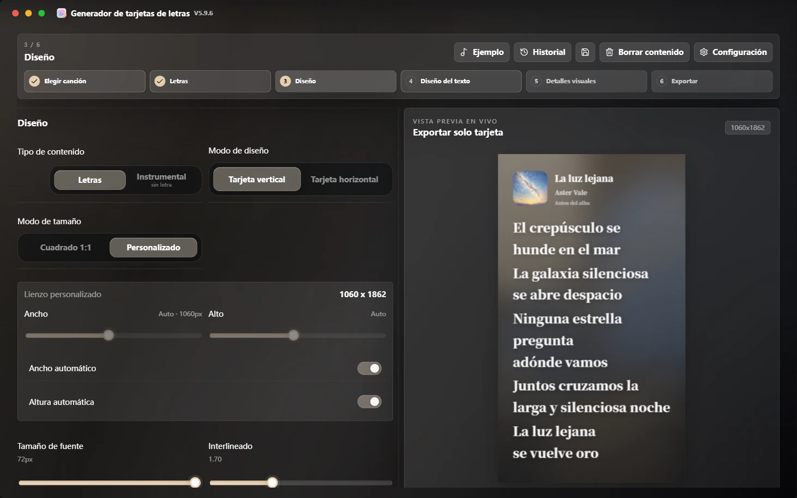
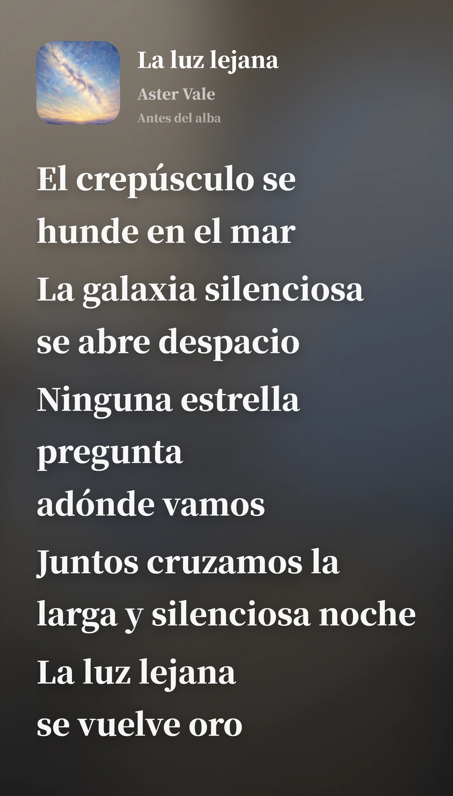
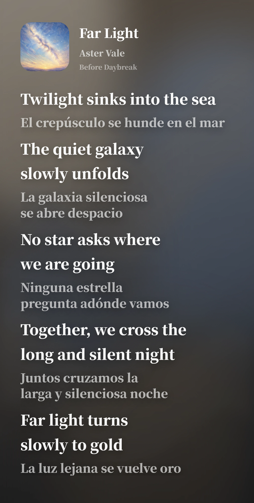

# 🎧 Lyrics Card Generator

### Genera tarjetas de letras de alta calidad listas para compartir

**Spotify / Apple Music / NetEase Cloud Music / QQ Music · aplicación de escritorio para Windows · exportación PNG / WebP / JPG en alta resolución · documentación multilingüe**

  <strong>Idioma</strong> 
  <a href="./README.md">简体中文</a> ·
  <a href="./README.zh-TW.md">繁體中文</a> ·
  <a href="./README.en.md">English</a> ·
  <a href="./README.fr.md">Français</a> ·
  <a href="./README.ja.md">日本語</a> ·
  <strong>Español</strong>

  <strong>Navegación</strong> 
  <a href="https://github.com/Qrzzzz/lyrics-card-generator/releases/latest">Descargar la última versión</a> ·
  <a href="./docs/releases/v6.2.4.es.md">Notas de la versión</a> ·
  <a href="https://qrzzzz.github.io/lyrics-card-generator/">Web Lite en línea</a> ·
  <a href="#funciones-principales">Funciones principales</a> ·
  <a href="./docs/development.en.md">Desarrollo local</a> ·
  <a href="./LICENSE">Licencia</a>

---

<strong>🖥️ Interfaz de la aplicación</strong>

<table>
  <tr>
    <td align="center" valign="top"> <b>Paso 3: Diseño · Colores dinámicos extraídos de la portada</b></td>
  </tr>
</table>

<strong>✨ Ejemplos de salida</strong>

<table>
  <tr>
    <td width="50%" align="center" valign="top"><b>Sin traducción · Español</b> </td>
    <td width="50%" align="center" valign="top"><b>Con traducción · Texto en inglés + traducción al español</b> </td>
  </tr>
</table>

Ambas imágenes se exportaron directamente desde la aplicación con anchura y altura automáticas y un interlineado de 1,7.

Una aplicación de escritorio para Windows que crea tarjetas de letras.
Pega un enlace de canción o introduce la información manualmente, edita letras, traducciones, portada y estilos visuales, y exporta una imagen PNG, WebP o JPG de alta resolución para compartir.

## 📦 Descarga e instalación

La v6.2.4 está publicada y disponible en [GitHub Releases](https://github.com/Qrzzzz/lyrics-card-generator/releases/latest):

* Instalador de Windows x64: `Lyrics.Card.Generator.Setup.6.2.4.exe`

A partir de v6.2.2, Setup para Windows x64 es el único paquete de escritorio distribuido.

> La compilación actual no está firmada. Windows puede mostrar una advertencia de SmartScreen, algo habitual en aplicaciones personales sin firma.

### Novedades de v6.2.4

* Los ajustes se reorganizan por su ámbito real: valores del pie para tarjetas nuevas, exportación de archivos, conexión y traducción con IA, historial y almacenamiento.
* Los fallos al guardar ajustes y datos de IA ahora permanecen visibles globalmente y permiten reintentar; los valores del pie ya no sobrescriben el documento actual.
* Se añaden una prueba segura de conexión de IA, la opción de no conservar el historial automático, un restablecimiento limitado, validación de fuentes, licencias sin conexión y mejoras de accesibilidad.

## 🌐 Notas de publicación multilingües

GitHub Release muestra de forma predeterminada un resumen en chino simplificado. Consulta las notas completas:
[简体中文](./docs/releases/v6.2.4.zh-CN.md) · [繁體中文](./docs/releases/v6.2.4.zh-TW.md) · [English](./docs/releases/v6.2.4.en.md) · [Français](./docs/releases/v6.2.4.fr.md) · [日本語](./docs/releases/v6.2.4.ja.md) · [Español](./docs/releases/v6.2.4.es.md)

## ✨ Funciones principales

### 🎨 Generación de imágenes y diseño del lienzo

* Genera imágenes de letras con acabado pulido
* Modos de tamaño vertical y tarjetas horizontales de proporción libre, con ancho de la región de letras y altura solicitada automáticos o manuales
* Planificación horizontal guiada por el contenido para la columna izquierda de portada/metadatos y la columna derecha solo de letras, sin recortar letras ni portada
* Ancho y altura automáticos medidos para lienzos verticales personalizados
* Exportación PNG, WebP y JPG de alta resolución
* Copia directa de un PNG de alta calidad al portapapeles del sistema

### 📝 Diseño y traducción de letras

* Diseño de letra original y traducción
* Conservación de una selección exacta en cualquiera de las columnas, con deshacer y rehacer
* Separación automática de líneas original / traducción con detección de chino simplificado, chino tradicional, inglés, francés, japonés y español
* Traducción de letras con IA mediante API Chat Completions compatibles con OpenAI, con URL del proveedor, modelo, clave API, seis preajustes predeterminados, hasta dos personalizados, Reasoning y salida en streaming configurables

### 🎵 Búsqueda de canciones, enlaces musicales y archivos locales

* Busca en NetEase Cloud Music por título, artista o álbum e importa metadatos y letras desde el resultado elegido
* Análisis de enlaces de Spotify, Apple Music, NetEase Cloud Music y QQ Music
* Análisis de metadatos MP3 / FLAC / M4A locales para título, artista, álbum, portada y letras incrustadas

### ✍️ Edición manual y subida de material

* Edición manual de título, artista, portada y letra
* Subida de portada local

### 🌈 Estilo visual e información de marca

* Extracción de paleta desde la portada para fondos degradados
* Modos de apariencia de la interfaz: Dinámico del álbum, oscuro, claro, Acrílico oscuro y Acrílico claro
* Logo de plataforma, texto de compartido por y marca de agua generada

### 🔤 Fuentes e interfaz multilingüe

* Combinaciones Source Han Sans / Serif, fuentes CJK y latinas independientes, selector de fuentes del sistema y vista previa con letras reales
* Interfaz en chino simplificado, chino tradicional, inglés, francés, japonés y español

### 🚀 Actualizaciones

* Búsqueda de actualizaciones en GitHub Releases

### 🪟 Versión de escritorio para Windows

* Electron integra la interfaz Next.js y la API local; el EXE inicia el servicio incluido en un puerto dinámico de `127.0.0.1`, sin que el usuario tenga que instalar Node.js
* El modo sin conexión cubre la edición manual, portadas locales, análisis de MP3 / FLAC / M4A locales, estilos y exportación PNG / WebP / JPG
* Los enlaces musicales, la búsqueda en NetEase Cloud Music, las portadas y letras remotas, la traducción con IA y las actualizaciones de GitHub requieren conexión
* Los mantenedores pueden consultar la [guía de mantenimiento de escritorio](./docs/desktop.md) y la [guía de desarrollo en inglés](./docs/development.en.md)

## 🙏 Agradecimientos

Gracias a [Apple Music](https://music.apple.com/). Los degradados de color, la estética de fondo con luz fluida y la orientación inicial del diseño de las tarjetas de letras de este proyecto se inspiraron en la experiencia visual de Apple Music. Este proyecto no está afiliado a Apple Music ni representa la postura oficial de Apple Music.

Gracias a [Source Han Sans](https://github.com/adobe-fonts/source-han-sans) y [Source Han Serif](https://github.com/adobe-fonts/source-han-serif). Proporcionan una base tipográfica estable, clara y con peso para las tarjetas de letras en chino.

Gracias a [OpenAI Codex](https://openai.com/codex/). Convirtió muchas ideas dispersas en código ejecutable, flujos de build para la versión de escritorio y funciones reales.

Gracias a [ChatGPT 5.6 Sol](https://chatgpt.com/) por ayudar durante el desarrollo con la localización de problemas, el diseño de soluciones, la revisión de correcciones y las comprobaciones de aceptación.

Gracias a [ReactBits](https://www.reactbits.dev/) por varias ideas de UI, incluidas inspiraciones de animación como Spark Cursor.

Gracias a [Rangerov](https://github.com/rangerov0716) por prestar atención a este proyecto y aportar sugerencias.

Gracias a [V0idream](https://github.com/V0idream) por proponer mejoras para aligerar el código. [`v1.1.0`](https://github.com/Qrzzzz/lyrics-card-generator/releases/tag/v1.1.0) ya incorporó optimizaciones relacionadas.

Gracias a las siguientes canciones y sus creadores. Sirven como ejemplos del proyecto, ayudando a verificar cómo se muestran las tarjetas de letras en diferentes idiomas, fuentes, longitudes de traducción y ritmos de composición.

Desplegar para ver ejemplos de canciones

| Canción | Álbum | Artista |
| --- | --- | --- |
| 《opposite》 | *emails i can't send fwd:* | [Sabrina Carpenter](https://www.sabrinacarpenter.com/) |
| 《勇者》 | *THE BOOK 3* | [YOASOBI](https://www.yoasobi-music.jp/) |
| 《光辉岁月》 | *命运派对* | [Beyond](https://music.apple.com/cn/artist/beyond/79668659) |
| 《Opalite》 | *The Life of a Showgirl* | [Taylor Swift](https://www.taylorswift.com/) |
| 《honeybee》 | *you seem pretty sad for a girl so in love* | [Olivia Rodrigo](https://www.oliviarodrigo.com/) |
| 《Lies》 | *Always - EP* | [BIGBANG](https://ygfamily.com/en/artists/bigbang/discography) |

Gracias también a estos proyectos open source y a sus mantenedores: [Next.js](https://nextjs.org/), [React](https://react.dev/), [TypeScript](https://www.typescriptlang.org/), [Tailwind CSS](https://tailwindcss.com/), [Electron](https://www.electronjs.org/), [electron-builder](https://www.electron.build/), [html-to-image](https://github.com/bubkoo/html-to-image), [Framer Motion](https://motion.dev/), [Lucide React](https://lucide.dev/), [Cheerio](https://cheerio.js.org/), [Zod](https://zod.dev/) y las numerosas cadenas de herramientas que forman el ecosistema frontend moderno. Sin esta infraestructura, este proyecto no existiría en su forma actual.

## 📄 Licencia

Este proyecto se publica bajo una licencia Source Available personalizada, no una licencia open-source tradicional.

Puedes ver, descargar, ejecutar y modificar de forma privada el código fuente para fines personales, no comerciales, educativos y de evaluación. El uso comercial, la redistribución, el reempaquetado, las versiones modificadas públicas y los productos competidores basados en este proyecto requieren autorización previa por escrito del titular de los derechos.

Las dependencias open-source de terceros siguen rigiéndose por sus respectivas licencias. Consulta [LICENSE](./LICENSE) para más detalles.
