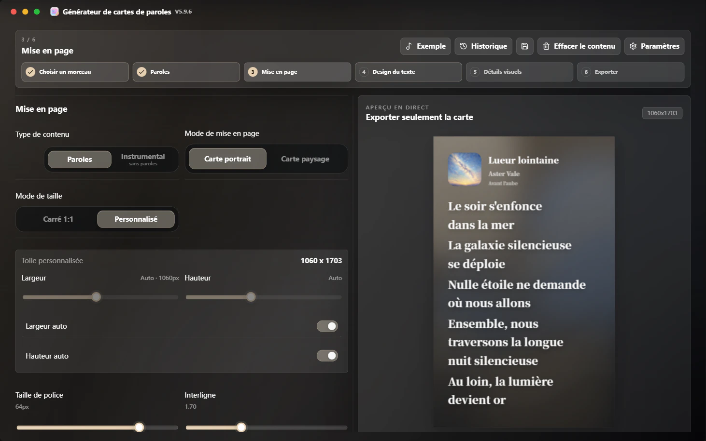
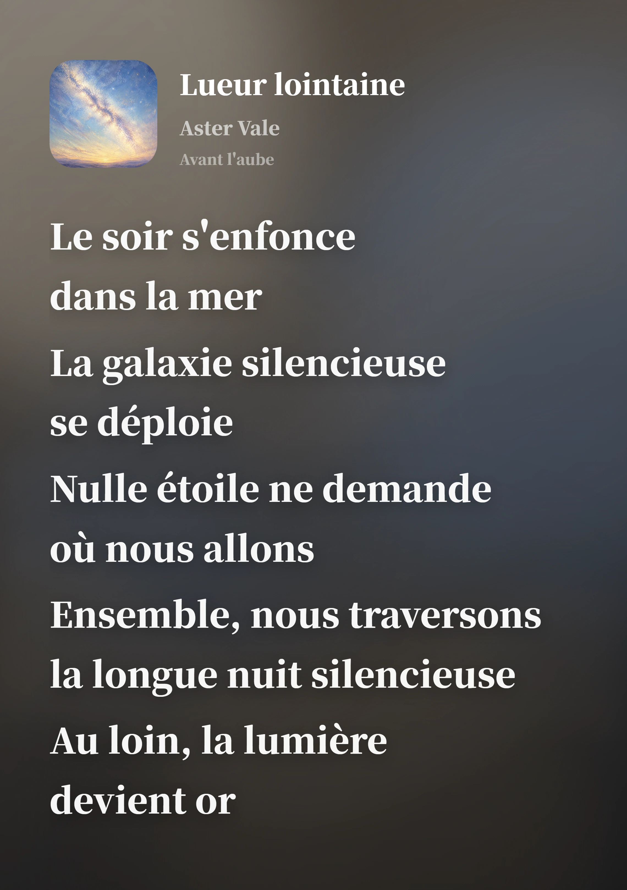
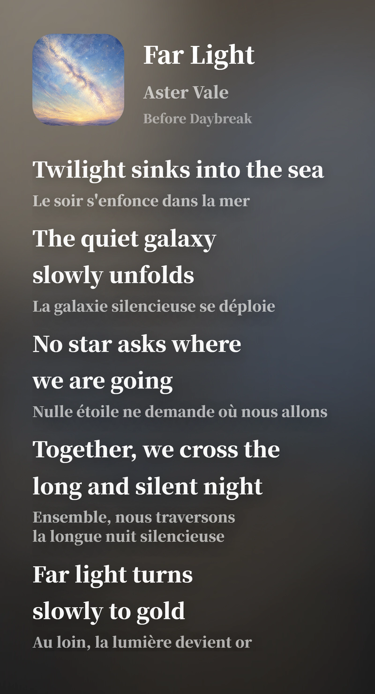

# 🎧 Lyrics Card Generator

### Générez des cartes de paroles soignées prêtes à partager

**Spotify / Apple Music / NetEase Cloud Music / QQ Music · application de bureau Windows · export PNG / WebP / JPG haute résolution · documentation multilingue**

  <strong>Langue</strong> 
  <a href="./README.md">简体中文</a> ·
  <a href="./README.zh-TW.md">繁體中文</a> ·
  <a href="./README.en.md">English</a> ·
  <strong>Français</strong> ·
  <a href="./README.ja.md">日本語</a> ·
  <a href="./README.es.md">Español</a>

  <strong>Navigation</strong> 
  <a href="https://github.com/Qrzzzz/lyrics-card-generator/releases/latest">Télécharger la dernière version</a> ·
  <a href="./docs/releases/v6.2.10.fr.md">Notes de version</a> ·
  <a href="https://qrzzzz.github.io/lyrics-card-generator/">Web Lite en ligne</a> ·
  <a href="#fonctionnalités-principales">Fonctionnalités principales</a> ·
  <a href="./docs/development.en.md">Développement local</a> ·
  <a href="./LICENSE">Licence</a>

---

<strong>🖥️ Interface de l’application</strong>

<table>
  <tr>
    <td align="center" valign="top"> <b>Étape 3 : Mise en page · Couleurs dynamiques extraites de la pochette</b></td>
  </tr>
</table>

<strong>✨ Exemples de rendu</strong>

<table>
  <tr>
    <td width="50%" align="center" valign="top"><b>Sans traduction · Français</b> </td>
    <td width="50%" align="center" valign="top"><b>Avec traduction · Texte anglais + traduction française</b> </td>
  </tr>
</table>

Les deux images ont été exportées directement depuis l’application, avec largeur et hauteur automatiques et un interligne de 1,7.

Une application Windows pour créer des cartes de paroles.
Collez un lien de morceau ou saisissez les informations manuellement, modifiez les paroles, traductions, pochettes et styles visuels, puis exportez une image PNG, WebP ou JPG haute résolution.

## 📦 Téléchargement et installation

Téléchargez la v6.2.10 depuis [GitHub Releases](https://github.com/Qrzzzz/lyrics-card-generator/releases/tag/v6.2.10). Le programme d’installation Windows est :

* Programme d’installation Windows x64 : `Lyrics.Card.Generator.Setup.6.2.10.exe`

À partir de la v6.2.2, le programme Setup Windows x64 est le seul paquet distribué.

> La version actuelle n'est pas signée. Windows peut afficher un avertissement SmartScreen, ce qui est courant pour une application personnelle non signée.

### Points forts de la v6.2.10

* Empêche une importation en attente de confirmation ou de sauvegarde du brouillon d’écraser un lien, des paroles ou un document modifiés entre-temps.
* Refuse les redirections HTTP pour la traduction IA et les tests de connexion afin de ne pas transmettre le corps des requêtes à une destination non autorisée.
* Réserve un délai de première réponse aux adresses de secours validées afin qu’une première adresse silencieuse n’épuise pas le délai global.
* Le badge Explicit utilise le SVG arrondi blanc validé, avec une opacité de 50 % et un E évidé transparent, dans l’aperçu et l’export.

## 🌐 Notes de publication multilingues

Par défaut, GitHub Release affiche un résumé en chinois simplifié. Consultez les notes complètes :
[简体中文](./docs/releases/v6.2.10.zh-CN.md) · [繁體中文](./docs/releases/v6.2.10.zh-TW.md) · [English](./docs/releases/v6.2.10.en.md) · [Français](./docs/releases/v6.2.10.fr.md) · [日本語](./docs/releases/v6.2.10.ja.md) · [Español](./docs/releases/v6.2.10.es.md)

## ✨ Fonctionnalités principales

### 🎨 Génération d'images et mise en page

* Génération d'images de paroles très soignées
* Modes de taille portrait et cartes paysage à ratio libre, avec largeur de zone de paroles et hauteur demandée automatiques ou manuelles
* Planification paysage guidée par le contenu pour la colonne pochette/métadonnées et la colonne de paroles, sans recadrer les paroles ni la pochette
* Largeur et hauteur automatiques mesurées pour les toiles portrait personnalisées
* Export PNG, WebP et JPG haute résolution
* Copie directe d’un PNG haute qualité dans le presse-papiers système

### 📝 Mise en page et traduction des paroles

* Mise en page originale des paroles et des traductions
* Conservation d’une sélection exacte dans l’une ou l’autre colonne, avec annulation et rétablissement
* Séparation automatique des lignes original / traduction avec détection du chinois simplifié, chinois traditionnel, anglais, français, japonais et espagnol
* Traduction de paroles par IA via les API Chat Completions compatibles OpenAI, avec URL du fournisseur, modèle, clé API, six préréglages par défaut, deux préréglages personnalisés, Reasoning et sortie en streaming configurables

### 🎵 Recherche de morceau, liens musicaux et analyse de fichiers locaux

* Recherche NetEase Cloud Music par titre, artiste ou album, puis import des métadonnées et paroles du résultat choisi
* Analyse de liens Spotify, Apple Music, NetEase Cloud Music et QQ Music
* Analyse de métadonnées MP3 / FLAC / M4A locales : titre, artiste, album, pochette et paroles intégrées

### ✍️ Édition manuelle et import de matériel

* Édition manuelle du titre, de l'artiste, de la pochette et des paroles
* Import de pochette locale

### 🌈 Style visuel et informations de marque

* Extraction de palette depuis la pochette pour créer des fonds en dégradé
* Modes d’apparence de l’interface : Dynamique de l’album, sombre, clair, Acrylique sombre et Acrylique clair
* Logo de plateforme, texte de partage et filigrane généré

### 🔤 Polices et interface multilingue

* Jeux Source Han Sans / Serif, polices CJK et latines indépendantes, sélecteur de polices système et aperçu avec de vraies paroles
* Interface en chinois simplifié, chinois traditionnel, anglais, français, japonais et espagnol

### 🚀 Mises à jour

* Vérification des mises à jour via GitHub Releases

### 🪟 Version Windows

* Electron encapsule l’interface Next.js et l’API locale ; l’EXE lance le service embarqué sur un port dynamique de `127.0.0.1`, sans installation de Node.js pour l’utilisateur
* Le démarrage hors ligne couvre l’édition manuelle, les pochettes locales, l’analyse MP3 / FLAC / M4A locale, les styles et l’export PNG / WebP / JPG
* Les liens musicaux, la recherche NetEase Cloud Music, les pochettes et paroles distantes, la traduction IA et la vérification GitHub nécessitent une connexion
* Les mainteneurs peuvent consulter le [guide de maintenance bureau](./docs/desktop.md) et le [guide de développement en anglais](./docs/development.en.md)

## 🙏 Remerciements

Merci à [Apple Music](https://music.apple.com/). Les dégradés colorés, l’esthétique des arrière-plans lumineux et fluides, ainsi que les premières orientations de mise en page des cartes de paroles de ce projet ont été inspirés par l’expérience visuelle d’Apple Music. Ce projet n’est pas affilié à Apple Music et ne représente pas la position officielle d’Apple Music.

Merci à [Source Han Sans](https://github.com/adobe-fonts/source-han-sans) et [Source Han Serif](https://github.com/adobe-fonts/source-han-serif). Elles fournissent une base typographique stable, claire et solide pour les cartes de paroles en chinois.

Merci à [OpenAI Codex](https://openai.com/codex/). Il a transformé de nombreuses idées éparses en code exécutable, en workflows de build desktop et en fonctionnalités réelles.

Merci à [ChatGPT 5.6 Sol](https://chatgpt.com/) pour le diagnostic des problèmes, la conception de solutions, la relecture des correctifs et les vérifications d’acceptation pendant le développement.

Merci à [ReactBits](https://www.reactbits.dev/) pour ses nombreuses idées d’interface, notamment des inspirations d’animation comme Spark Cursor.

Merci à [Rangerov](https://github.com/rangerov0716) pour l’attention portée à ce projet et pour ses retours.

Merci à [V0idream](https://github.com/V0idream) pour ses suggestions d’allègement du code. [`v1.1.0`](https://github.com/Qrzzzz/lyrics-card-generator/releases/tag/v1.1.0) a déjà été optimisée en conséquence.

Merci aux chansons suivantes et à leurs créateurs. Elles servent d’exemples pour le projet, aidant à vérifier l’affichage des cartes de paroles dans différentes langues, polices, longueurs de traduction et rythmes de mise en page.

Déplier pour voir les exemples de chansons

| Chanson | Album | Artiste |
| --- | --- | --- |
| 《opposite》 | *emails i can't send fwd:* | [Sabrina Carpenter](https://www.sabrinacarpenter.com/) |
| 《勇者》 | *THE BOOK 3* | [YOASOBI](https://www.yoasobi-music.jp/) |
| 《光辉岁月》 | *命运派对* | [Beyond](https://music.apple.com/cn/artist/beyond/79668659) |
| 《Opalite》 | *The Life of a Showgirl* | [Taylor Swift](https://www.taylorswift.com/) |
| 《honeybee》 | *you seem pretty sad for a girl so in love* | [Olivia Rodrigo](https://www.oliviarodrigo.com/) |
| 《Lies》 | *Always - EP* | [BIGBANG](https://ygfamily.com/en/artists/bigbang/discography) |

Merci également à ces projets open source et à leurs mainteneurs : [Next.js](https://nextjs.org/), [React](https://react.dev/), [TypeScript](https://www.typescriptlang.org/), [Tailwind CSS](https://tailwindcss.com/), [Electron](https://www.electronjs.org/), [electron-builder](https://www.electron.build/), [html-to-image](https://github.com/bubkoo/html-to-image), [Framer Motion](https://motion.dev/), [Lucide React](https://lucide.dev/), [Cheerio](https://cheerio.js.org/), [Zod](https://zod.dev/), ainsi qu’aux nombreuses chaînes d’outils qui composent l’écosystème frontend moderne. Sans ces infrastructures, ce projet n’aurait pas sa forme actuelle.

## 📄 Licence

Ce projet est publié sous une licence Source Available personnalisée, et non sous une licence open-source traditionnelle.

Vous pouvez consulter, télécharger, exécuter et modifier en privé le code source à des fins personnelles, non commerciales, éducatives et d'évaluation. L'utilisation commerciale, la redistribution, le repackaging, les versions modifiées publiques et les produits concurrents basés sur ce projet nécessitent une autorisation écrite préalable du détenteur des droits.

Les dépendances open-source tierces restent régies par leurs licences respectives. Consultez [LICENSE](./LICENSE) pour plus de détails.
