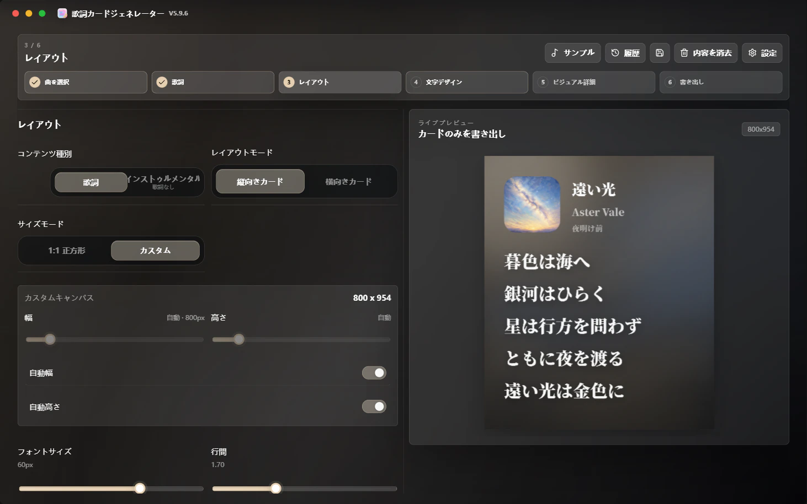
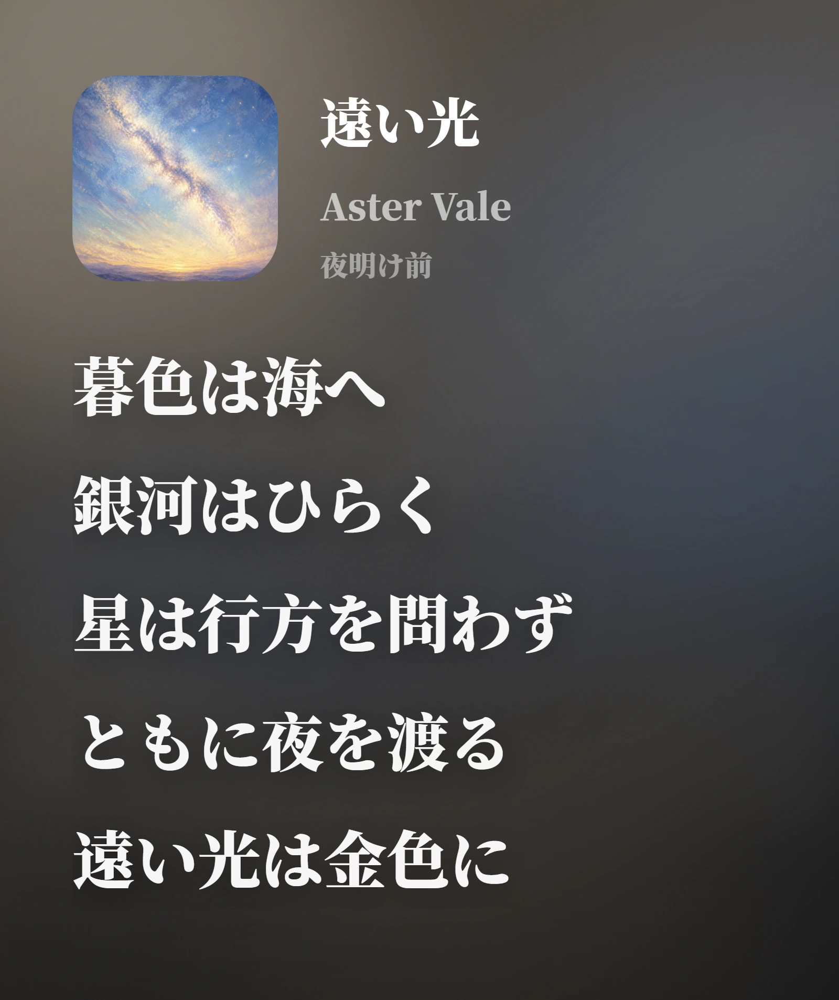
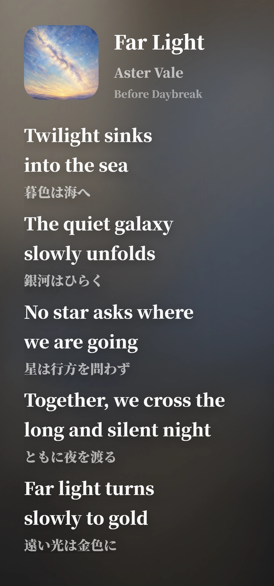

# 🎧 Lyrics Card Generator

### 共有に使える高品質な歌詞カードを生成

**Spotify / Apple Music / NetEase Cloud Music / QQ Music · Windows デスクトップアプリ · 高解像度 PNG / WebP / JPG 書き出し · 多言語ドキュメント**

  <strong>言語</strong> 
  <a href="./README.md">简体中文</a> ·
  <a href="./README.zh-TW.md">繁體中文</a> ·
  <a href="./README.en.md">English</a> ·
  <a href="./README.fr.md">Français</a> ·
  <strong>日本語</strong> ·
  <a href="./README.es.md">Español</a>

  <strong>ナビゲーション</strong> 
  <a href="https://github.com/Qrzzzz/lyrics-card-generator/releases/latest">最新版をダウンロード</a> ·
  <a href="./docs/releases/v6.2.1.ja.md">リリースノート</a> ·
  <a href="https://qrzzzz.github.io/lyrics-card-generator/">オンライン Web Lite 版</a> ·
  <a href="#主な機能">主な機能</a> ·
  <a href="./docs/development.en.md">ローカル開発</a> ·
  <a href="./LICENSE">ライセンス</a>

---

<strong>🖥️ アプリ画面</strong>

<table>
  <tr>
    <td align="center" valign="top"> <b>ステップ 3：レイアウト · アルバムカバーから抽出したダイナミックカラー</b></td>
  </tr>
</table>

<strong>✨ 生成例</strong>

<table>
  <tr>
    <td width="50%" align="center" valign="top"><b>翻訳なし · 日本語</b> </td>
    <td width="50%" align="center" valign="top"><b>翻訳あり · 英語原文 + 日本語訳</b> </td>
  </tr>
</table>

どちらもアプリから直接書き出した画像です。キャンバスは幅・高さともに自動、行間は 1.7 に設定しています。

歌詞共有カードを作成する Windows デスクトップアプリです。
曲リンクを貼り付けるか情報を手入力し、歌詞、翻訳、カバー、見た目を編集して、高解像度の PNG、WebP、JPG として書き出せます。

## 📦 ダウンロードとインストール

v6.2.1 は公開済みです。[GitHub Releases](https://github.com/Qrzzzz/lyrics-card-generator/releases/latest) から次のファイルを入手できます。

* インストーラー：`Lyrics Card Generator Setup 6.2.1.exe`
* ポータブル版：`Lyrics Card Generator-6.2.1-portable.exe`

通常利用にはインストーラーを推奨します。ポータブル版は一時利用、検証、リムーバブルドライブでの利用に向いています。

> 現在のビルドはコード署名されていません。Windows が SmartScreen 警告を表示する場合があります。これは未署名の個人アプリでは一般的です。

### v6.2.1 の主な更新

* 軽量通知が互いを上書きせず、下から上へ積み重なるようになり、種類と文字数に応じた個別の表示時間を使用します。
* いずれかの通知が終了すると残りが滑らかに詰め直され、ページがバックグラウンドに移るとタイマーを一時停止します。
* 同一通知は同じ位置で更新され、古いパネルが右へ移動しながら消え、新しいパネルが左から入りながら現れます。
* 横長カードの 12 行制限を歌詞ステップ内の警告へ変更し、対象内容へフォーカスを戻して、修正後は自動的に消えるようにしました。

## 🌐 多言語リリースノート

GitHub Release ではデフォルトで簡体字中国語の概要が表示されます。完全なリリースノートはこちら：
[简体中文](./docs/releases/v6.2.1.zh-CN.md) · [繁體中文](./docs/releases/v6.2.1.zh-TW.md) · [English](./docs/releases/v6.2.1.en.md) · [Français](./docs/releases/v6.2.1.fr.md) · [日本語](./docs/releases/v6.2.1.ja.md) · [Español](./docs/releases/v6.2.1.es.md)

## ✨ 主な機能

### 🎨 画像生成とキャンバスレイアウト

* 高品質な歌詞共有画像を生成
* 縦向きのサイズモードと、歌詞領域幅・要求高さを自動または手動で設定できる自由比率の横向きカード
* カバー／曲情報の左列と歌詞専用の右列を実コンテンツから求解し、歌詞やカバーを切り抜かない横向きレイアウト
* 縦向きカスタムキャンバスで実測に基づく自動幅と自動高さ
* 高解像度 PNG、WebP、JPG 書き出し
* 高品質 PNG をシステムのクリップボードへ直接コピー

### 📝 歌詞のレイアウトと翻訳

* 原文歌詞と翻訳のレイアウト
* 原文または翻訳の列で選択した範囲だけを残し、元に戻す／やり直しに対応
* 簡体字中国語、繁体字中国語、英語、フランス語、日本語、スペイン語の目標言語検出による原文 / 翻訳の自動分割
* OpenAI 互換 Chat Completions API を使う AI 歌詞翻訳。プロバイダー URL、モデル、API キー、6 件の既定プリセット、最大 2 件のカスタムプリセット、Reasoning、ストリーミング出力を設定可能

### 🎵 曲検索、音楽リンクとローカルファイル解析

* NetEase Cloud Music で曲名、アーティスト、アルバムを検索し、選択した結果から楽曲情報と歌詞を取り込めます
* Spotify、Apple Music、NetEase Cloud Music、QQ Music のリンク解析
* ローカル MP3 / FLAC / M4A からタイトル、アーティスト、アルバム、カバー、埋め込み歌詞を解析

### ✍️ 手動編集と素材アップロード

* 曲名、アーティスト、カバー、歌詞の手動編集
* ローカルカバーのアップロード

### 🌈 ビジュアルスタイルとブランド情報

* カバーから色を抽出してグラデーション背景を生成
* アプリ画面はアルバム動的カラー、ダーク、ライト、ダークアクリル、ライトアクリルの 5 つの外観モードに対応
* プラットフォームロゴ、共有者テキスト、生成ウォーターマーク

### 🔤 フォントと多言語インターフェース

* 源ノ角ゴシック / 源ノ明朝の構成、CJK / 欧文フォントの個別選択、システムフォント選択画面、実際の歌詞によるプレビュー
* 簡体字中国語、繁体字中国語、英語、フランス語、日本語、スペイン語インターフェース

### 🚀 バージョンアップデート

* GitHub Releases によるアップデート確認

### 🪟 Windows デスクトップ版

* Electron が Next.js の画面とローカル API をまとめます。EXE は同梱サービスを `127.0.0.1` の動的ポートで起動するため、利用者による Node.js の導入は不要です
* オフライン起動では、手動編集、ローカルカバー、ローカル MP3 / FLAC / M4A 解析、スタイル調整、PNG / WebP / JPG 書き出しを利用できます
* 音楽サービスのリンク、NetEase Cloud Music 検索、リモートのカバーと歌詞、AI 翻訳、GitHub の更新確認にはネットワーク接続が必要です
* 保守担当者向け情報は[デスクトップ保守ガイド](./docs/desktop.md)と[英語の開発ガイド](./docs/development.en.md)にあります

## 🙏 謝辞

[Apple Music](https://music.apple.com/) に感謝します。このプロジェクトの色鮮やかなグラデーション、流れる光の背景美学、そして初期の歌詞カードレイアウトの方向性は、Apple Music のビジュアル体験から着想を得ています。本プロジェクトは Apple Music と関係がなく、Apple Music の公式見解を代表するものでもありません。

[Source Han Sans](https://github.com/adobe-fonts/source-han-sans) と [Source Han Serif](https://github.com/adobe-fonts/source-han-serif) に感謝します。これらは中国語歌詞カードに、安定していて明瞭で、存在感のある書体基盤を提供しています。

[OpenAI Codex](https://openai.com/codex/) に感謝します。多くの断片的なアイデアを、実行可能なコード、デスクトップ版のビルドフロー、実際の機能へと変換してくれました。

[ChatGPT 5.6 Sol](https://chatgpt.com/) に感謝します。開発過程での問題特定、方案設計、修正レビュー、受け入れ確認を支援しました。

[ReactBits](https://www.reactbits.dev/) に感謝します。Spark Cursor などのモーションを含む、さまざまな UI アイデアの着想を提供してくれました。

[Rangerov](https://github.com/rangerov0716) に感謝します。このプロジェクトへの関心と意見に感謝します。

[V0idream](https://github.com/V0idream) によるコード軽量化の提案に感謝します。[`v1.1.0`](https://github.com/Qrzzzz/lyrics-card-generator/releases/tag/v1.1.0) では、それに基づく関連最適化を実施済みです。

以下の楽曲とそのクリエイターに感謝します。これらはプロジェクトのサンプルとして、異なる言語、フォント、翻訳の長さ、レイアウトのリズムにおける歌詞カードの表示効果の検証に役立ちました。

サンプル楽曲を展開

| 楽曲 | アルバム | アーティスト |
| --- | --- | --- |
| 《opposite》 | *emails i can't send fwd:* | [Sabrina Carpenter](https://www.sabrinacarpenter.com/) |
| 《勇者》 | *THE BOOK 3* | [YOASOBI](https://www.yoasobi-music.jp/) |
| 《光辉岁月》 | *命运派对* | [Beyond](https://music.apple.com/cn/artist/beyond/79668659) |
| 《Opalite》 | *The Life of a Showgirl* | [Taylor Swift](https://www.taylorswift.com/) |
| 《honeybee》 | *you seem pretty sad for a girl so in love* | [Olivia Rodrigo](https://www.oliviarodrigo.com/) |
| 《Lies》 | *Always - EP* | [BIGBANG](https://ygfamily.com/en/artists/bigbang/discography) |

また、これらのオープンソースプロジェクトとそのメンテナーにも感謝します：[Next.js](https://nextjs.org/)、[React](https://react.dev/)、[TypeScript](https://www.typescriptlang.org/)、[Tailwind CSS](https://tailwindcss.com/)、[Electron](https://www.electronjs.org/)、[electron-builder](https://www.electron.build/)、[html-to-image](https://github.com/bubkoo/html-to-image)、[Framer Motion](https://motion.dev/)、[Lucide React](https://lucide.dev/)、[Cheerio](https://cheerio.js.org/)、[Zod](https://zod.dev/)、そして現代的なフロントエンドエコシステムを構成する多くのツールチェーン。これらの基盤がなければ、このプロジェクトは現在の形では存在していません。

## 📄 ライセンス

このプロジェクトは、従来のオープンソースライセンスではなく、独自の Source Available License の下で公開されています。

個人、非商用、教育、評価目的でソースコードを閲覧、ダウンロード、実行し、個人的に改変できます。商用利用、再配布、再パッケージング、公開された改変版、または本プロジェクトを基にした競合製品には、権利者からの事前の書面許可が必要です。

サードパーティのオープンソース依存関係は、それぞれのライセンスに従います。詳細は [LICENSE](./LICENSE) を参照してください。
