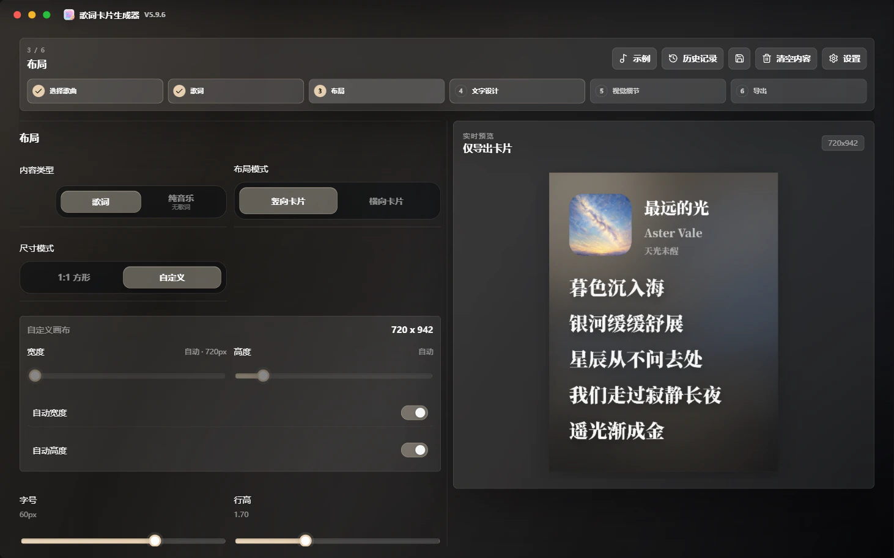

# 🎧 Lyrics Card Generator

### 生成可用于分享的高质感歌词分享卡片

**Spotify / Apple Music / 网易云音乐 / QQ 音乐 · Windows 桌面应用 · 高清 PNG / WebP / JPG 导出 · 多语言文档**

  <strong>语言</strong> 
  <strong>简体中文</strong> ·
  <a href="./README.zh-TW.md">繁體中文</a> ·
  <a href="./README.en.md">English</a> ·
  <a href="./README.fr.md">Français</a> ·
  <a href="./README.ja.md">日本語</a> ·
  <a href="./README.es.md">Español</a>

  <strong>导航</strong> 
  <a href="https://github.com/Qrzzzz/lyrics-card-generator/releases/latest">下载最新版</a> ·
  <a href="./docs/releases/v5.12.1.zh-CN.md">发布说明</a> ·
  <a href="https://qrzzzz.github.io/lyrics-card-generator/">在线 Web Lite 版</a> ·
  <a href="./docs/web-lite-browser-support.md">Web Lite 浏览器支持</a> ·
  <a href="./docs/desktop.md">桌面维护文档</a> ·
  <a href="#主要功能">主要功能</a> ·
  <a href="./docs/development.zh-CN.md">本地开发</a> ·
  <a href="./LICENSE">许可证</a>

---

<strong>🖥️ 软件界面</strong>

<table>
  <tr>
    <td align="center" valign="top"> <b>第三步：布局 · 专辑封面动态取色</b></td>
  </tr>
</table>

<strong>✨ 成品示例</strong>

<table>
  <tr>
    <td width="50%" align="center" valign="top"><b>无翻译 · 中文</b> </td>
    <td width="50%" align="center" valign="top"><b>有翻译 · 英文原文 + 中文译文</b> </td>
  </tr>
</table>

两张图片均由应用直接导出；画布采用自动宽度、自动高度，行高为 1.7。

## 📦 下载与安装

请从 [GitHub Releases](https://github.com/Qrzzzz/lyrics-card-generator/releases/latest) 下载 v5.12.1：

* 安装版：`Lyrics Card Generator Setup 5.12.1.exe`
* 便携版：`Lyrics Card Generator-5.12.1-portable.exe`

安装版适合长期使用；便携版适合临时运行、测试或放在移动硬盘中使用。

> 当前版本未进行代码签名。Windows 可能显示 SmartScreen 提示，这是未签名个人应用常见现象。

### v5.12.1 更新重点

* 第二步顶部工具栏首位新增轻量强调的“仅保留选中”，没有选中文本时保持禁用。
* 可精确保留原文或译文栏中的所选字符，删除当前栏其余内容，并保持另一栏不变。
* 操作支持选区恢复与撤销／重做，处理后可继续编辑或立即撤销。

## 🌐 多语言发布说明

GitHub Release 默认展示简体中文摘要，完整说明见：
[简体中文](./docs/releases/v5.12.1.zh-CN.md) · [繁體中文](./docs/releases/v5.12.1.zh-TW.md) · [English](./docs/releases/v5.12.1.en.md) · [Français](./docs/releases/v5.12.1.fr.md) · [日本語](./docs/releases/v5.12.1.ja.md) · [Español](./docs/releases/v5.12.1.es.md)

## ✨ 主要功能

### 🎨 图片生成与画布布局

* 生成高质感歌词分享图片
* 支持竖版尺寸模式，以及自动或手动歌词区域宽度与请求高度的自由比例横版
* 横版按真实内容求解封面／歌曲信息左列与歌词右列，不裁切歌词或封面
* 竖版自定义尺寸支持基于真实 DOM 测量的自动宽度与自动高度
* 支持导出高清 PNG、WebP 和 JPG 图片

### 📝 歌词排版与翻译

* 支持歌词原文与翻译并排排版
* 支持仅保留原文或译文栏中的精确选区，并可撤销／重做
* 支持按当前界面语言拆分原文 / 译文，包括简体中文、繁体中文、英文、法语、日语、西班牙语目标译文
* 支持兼容 OpenAI Chat Completions 的 AI 歌词翻译，可配置厂商 Base URL、模型、API Key、6 个默认预设、最多 2 个自定义预设、Reasoning 和流式输出

### 🎵 歌曲搜索、音乐链接与本地文件解析

* 支持通过网易云音乐搜索歌名、歌手或专辑，并从候选结果导入歌曲信息与歌词
* 支持 Spotify、Apple Music、网易云音乐、QQ 音乐链接解析
* 支持本地 MP3 / FLAC / M4A 元数据解析，尝试读取标题、艺人、专辑、封面和内嵌歌词

### ✍️ 手动编辑与素材上传

* 支持手动填写歌曲名、艺人、封面和歌词
* 支持本地封面上传

### 🌈 视觉样式与品牌信息

* 支持从封面提取色彩并生成渐变背景
* 软件界面支持专辑封面动态取色、深色、浅色、深色亚克力和浅色亚克力五种外观模式
* 支持平台 Logo、分享人、生成水印

### 🔤 字体与多语言界面

* 支持思源黑体 / 思源宋体两套字体方案、自定义中日韩 / 西文字体、系统字体选择弹窗与真实歌词字体预览
* 支持简体中文 / 繁體中文 / English / Français / 日本語 / Español 界面切换

### 🚀 版本更新

* 支持从 GitHub Releases 检查新版本

### 🪟 Windows 桌面版

* 通过 Electron 封装 Next.js 界面与本地 API；启动 EXE 时会在 `127.0.0.1` 的动态端口运行随包附带的本地服务，无需用户安装 Node.js
* 支持离线启动；手动编辑、本地封面、本地 MP3 / FLAC / M4A 解析、样式调整与 PNG / WebP / JPG 导出均可离线使用
* 音乐平台链接、网易云音乐搜索、远程封面与歌词、AI 翻译及 GitHub 更新检查需要联网
* 维护者可查看[桌面维护文档](./docs/desktop.md)；环境搭建、测试与打包命令见[开发指南](./docs/development.zh-CN.md)

## 🙏 致谢

感谢 [Apple Music](https://music.apple.com/)。这个项目的彩色渐变、流光背景审美，以及早期歌词卡片排版方向，受到 Apple Music 视觉体验的启发。本项目与 Apple Music 没有关联，也不代表 Apple Music 官方立场。

感谢 [思源黑体](https://github.com/adobe-fonts/source-han-sans) 和 [思源宋体](https://github.com/adobe-fonts/source-han-serif)。它们为中文歌词卡片提供了稳定、清晰、有分量的字体基础。

感谢 [OpenAI Codex](https://openai.com/codex/)。它把许多零散想法转化为可运行的代码、桌面版构建流程和实际功能。

感谢 [ChatGPT 5.6 Sol](https://chatgpt.com/) 在开发过程中进行问题定位、方案设计、修复复核和验收检查。

感谢 [ReactBits](https://www.reactbits.dev/) 提供的多种 UI 创意，包括 Spark Cursor 等动效灵感。

感谢 [Rangerov](https://github.com/rangerov0716) 对此项目的关注和提出意见。

感谢 [V0idream](https://github.com/V0idream) 提出的代码瘦身建议，[`v1.1.0`](https://github.com/Qrzzzz/lyrics-card-generator/releases/tag/v1.1.0) 已据此进行了相关优化。

感谢以下歌曲及其创作者。它们作为项目样例，帮助验证歌词卡片在不同语言、字体、翻译长度和排版节奏下的显示效果。

展开查看歌曲样例

| 歌曲         | 专辑                         | 艺术家                                                    |
| ---------- | -------------------------- | ------------------------------------------------------ |
| 《opposite》 | *emails i can't send fwd:* | [Sabrina Carpenter](https://www.sabrinacarpenter.com/) |
| 《勇者》       | *THE BOOK 3*               | [YOASOBI](https://www.yoasobi-music.jp/)               |
| 《光辉岁月》    | *命运派对*                   | [Beyond](https://music.apple.com/cn/artist/beyond/79668659) |
| 《Opalite》 | *The Life of a Showgirl* | [Taylor Swift](https://www.taylorswift.com/)                |
| 《honeybee》 | *you seem pretty sad for a girl so in love* | [Olivia Rodrigo](https://www.oliviarodrigo.com/) |
| 《Lies》 | *Always - EP* | [BIGBANG](https://ygfamily.com/en/artists/bigbang/discography) |

也感谢这些开源项目及其维护者：[Next.js](https://nextjs.org/)、[React](https://react.dev/)、[TypeScript](https://www.typescriptlang.org/)、[Tailwind CSS](https://tailwindcss.com/)、[Electron](https://www.electronjs.org/)、[electron-builder](https://www.electron.build/)、[html-to-image](https://github.com/bubkoo/html-to-image)、[Framer Motion](https://motion.dev/)、[Lucide React](https://lucide.dev/)、[Cheerio](https://cheerio.js.org/)、[Zod](https://zod.dev/)，以及构成现代前端生态的众多工具链。没有这些基础设施，这个项目不会以现在的形态出现。

## 📄 许可证

本项目采用自定义 Source Available License，而不是传统开源许可证。

你可以为了个人、非商业、学习、评估目的查看、下载、运行源码，并进行仅限个人使用的私下修改。未经作者书面许可，不得商用、再分发、重新打包、公开发布修改版，或基于本项目制作竞争性产品。

本项目依赖的第三方开源组件仍遵循它们各自的许可证。详见 [LICENSE](./LICENSE)。
