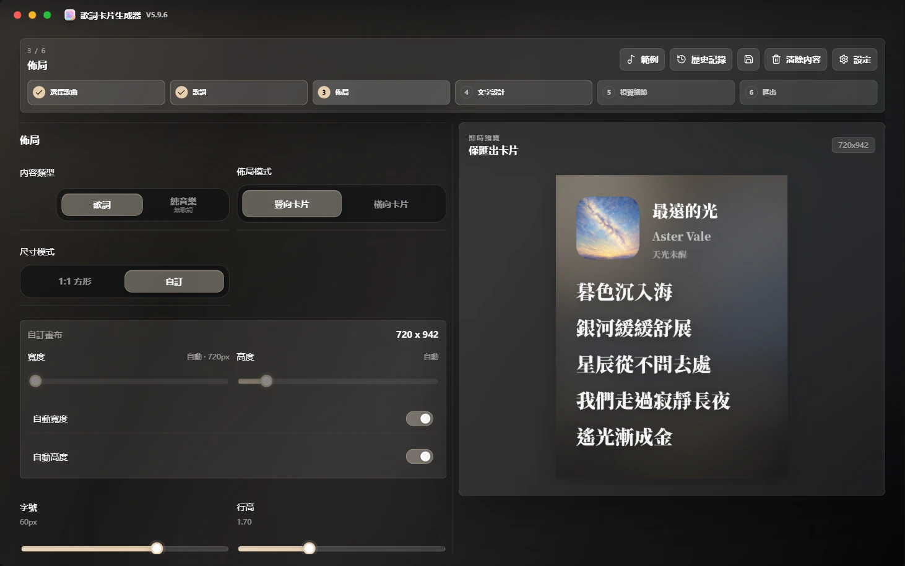
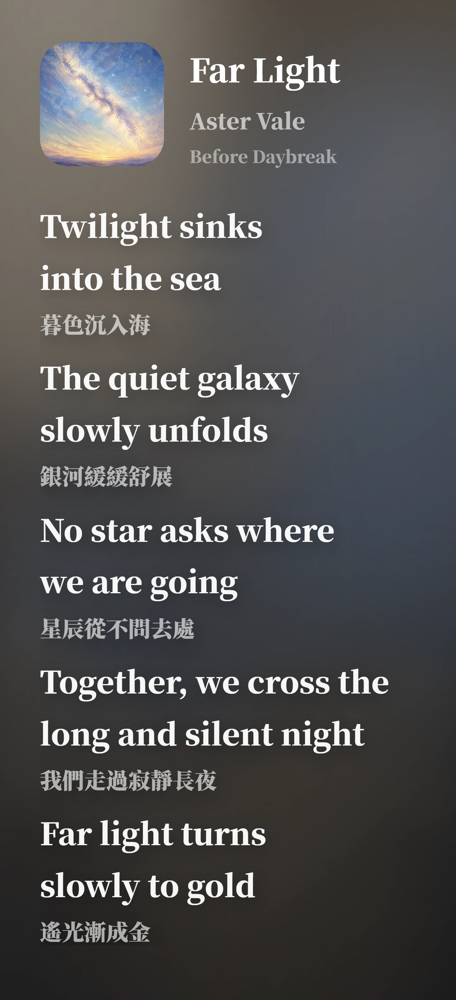

# 🎧 Lyrics Card Generator

### 生成可用於分享的高質感歌詞分享卡片

**Spotify / Apple Music / 網易雲音樂 / QQ 音樂 · Windows 桌面應用程式 · 高清 PNG / WebP / JPG 匯出 · 多語言文件**

  <strong>語言</strong> 
  <a href="./README.md">简体中文</a> ·
  <strong>繁體中文</strong> ·
  <a href="./README.en.md">English</a> ·
  <a href="./README.fr.md">Français</a> ·
  <a href="./README.ja.md">日本語</a> ·
  <a href="./README.es.md">Español</a>

  <strong>導覽</strong> 
  <a href="https://github.com/Qrzzzz/lyrics-card-generator/releases/latest">下載最新版</a> ·
  <a href="./docs/releases/v5.12.1.zh-TW.md">發布說明</a> ·
  <a href="https://qrzzzz.github.io/lyrics-card-generator/">線上 Web Lite 版</a> ·
  <a href="#主要功能">主要功能</a> ·
  <a href="./docs/development.zh-CN.md">本機開發</a> ·
  <a href="./LICENSE">授權條款</a>

---

<strong>🖥️ 軟體介面</strong>

<table>
  <tr>
    <td align="center" valign="top"> <b>第三步：版面 · 專輯封面動態取色</b></td>
  </tr>
</table>

<strong>✨ 成品範例</strong>

<table>
  <tr>
    <td width="50%" align="center" valign="top"><b>無翻譯 · 繁體中文</b> </td>
    <td width="50%" align="center" valign="top"><b>有翻譯 · 英文原文 + 繁體中文譯文</b> </td>
  </tr>
</table>

兩張圖片皆由應用程式直接匯出；畫布採用自動寬度、自動高度，行高為 1.7。

## 📦 下載與安裝

請從 [GitHub Releases](https://github.com/Qrzzzz/lyrics-card-generator/releases/latest) 下載 v5.12.1：

* 安裝版：`Lyrics Card Generator Setup 5.12.1.exe`
* 可攜版：`Lyrics Card Generator-5.12.1-portable.exe`

安裝版適合長期使用；可攜版適合臨時執行、測試或放在隨身碟中使用。

> 目前版本尚未進行程式碼簽章。Windows 可能顯示 SmartScreen 提示，這是未簽章個人應用常見現象。

### v5.12.1 更新重點

* 第二步頂端工具列首位新增輕量強調的「僅保留所選內容」，未選取文字時維持停用。
* 可精確保留原文或譯文欄中的所選字元，刪除目前欄的其餘內容，並保持另一欄不變。
* 操作支援選取範圍還原與復原／重做，處理後可繼續編輯或立即復原。

## 🌐 多語言發佈說明

GitHub Release 預設顯示簡體中文摘要，完整說明請見：
[简体中文](./docs/releases/v5.12.1.zh-CN.md) · [繁體中文](./docs/releases/v5.12.1.zh-TW.md) · [English](./docs/releases/v5.12.1.en.md) · [Français](./docs/releases/v5.12.1.fr.md) · [日本語](./docs/releases/v5.12.1.ja.md) · [Español](./docs/releases/v5.12.1.es.md)

## ✨ 主要功能

### 🎨 圖片生成與畫布版面

* 生成高質感歌詞分享圖片
* 支援直式尺寸模式，以及可自動或手動設定歌詞區域寬度與請求高度的自由比例橫式卡片
* 橫式卡片依真實內容求解封面／歌曲資訊左欄與歌詞右欄，不裁切歌詞或封面
* 直式自訂尺寸支援基於真實 DOM 測量的自動寬度與自動高度
* 支援匯出高解析 PNG、WebP 與 JPG 圖片

### 📝 歌詞排版與翻譯

* 支援歌詞原文與翻譯並排排版
* 支援僅保留原文或譯文欄中的精確選取範圍，並可復原／重做
* 支援按目前介面語言拆分原文 / 譯文，包括簡體中文、繁體中文、英文、法文、日文、西班牙文目標譯文
* 支援相容 OpenAI Chat Completions 的 AI 歌詞翻譯，可設定服務商 Base URL、模型、API Key、6 個預設、最多 2 個自訂預設、Reasoning 與串流輸出

### 🎵 歌曲搜尋、音樂連結與本機檔案解析

* 支援透過網易雲音樂搜尋歌名、歌手或專輯，並從候選結果匯入歌曲資訊與歌詞
* 支援 Spotify、Apple Music、網易雲音樂、QQ 音樂連結解析
* 支援本機 MP3 / FLAC / M4A 中繼資料解析，嘗試讀取標題、藝人、專輯、封面和內嵌歌詞

### ✍️ 手動編輯與素材上傳

* 支援手動填寫歌曲名、藝人、封面和歌詞
* 支援本機封面上傳

### 🌈 視覺樣式與品牌資訊

* 支援從封面擷取色彩並生成漸層背景
* 軟體介面支援專輯封面動態取色、深色、淺色、深色壓克力與淺色壓克力五種外觀模式
* 支援平台 Logo、分享人、生成浮水印

### 🔤 字型與多語言介面

* 支援思源黑體 / 思源宋體兩套字型方案、自訂中日韓 / 西文字型、系統字型選擇視窗與真實歌詞字型預覽
* 支援簡體中文 / 繁體中文 / English / Français / 日本語 / Español 介面切換

### 🚀 版本更新

* 支援從 GitHub Releases 檢查新版本

### 🪟 Windows 桌面版

* Electron 封裝 Next.js 介面與本機 API；EXE 會在 `127.0.0.1` 的動態連接埠啟動隨包附帶的本機服務，使用者不必安裝 Node.js
* 可離線啟動；手動編輯、本機封面、本機 MP3 / FLAC / M4A 解析、樣式調整與 PNG / WebP / JPG 匯出均可離線使用
* 音樂平台連結、網易雲音樂搜尋、遠端封面與歌詞、AI 翻譯及 GitHub 更新檢查需要連線
* 維護者可查看[桌面維護文件](./docs/desktop.md)；環境建置、測試與打包指令請參閱[簡體中文開發指南](./docs/development.zh-CN.md)

## 🙏 致謝

感謝 [Apple Music](https://music.apple.com/)。這個專案的彩色漸層、流光背景美學，以及早期歌詞卡片排版方向，受到 Apple Music 視覺體驗的啟發。本專案與 Apple Music 沒有關聯，也不代表 Apple Music 官方立場。

感謝 [思源黑體](https://github.com/adobe-fonts/source-han-sans) 和 [思源宋體](https://github.com/adobe-fonts/source-han-serif)。它們為中文歌詞卡片提供穩定、清晰、有分量的字型基礎。

感謝 [OpenAI Codex](https://openai.com/codex/)。它把許多零散想法轉化為可執行的程式碼、桌面版建構流程和實際功能。

感謝 [ChatGPT 5.6 Sol](https://chatgpt.com/) 在開發過程中進行問題定位、方案設計、修復複核和驗收檢查。

感謝 [ReactBits](https://www.reactbits.dev/) 提供的多種 UI 創意，包括 Spark Cursor 等動效靈感。

感謝 [Rangerov](https://github.com/rangerov0716) 對此專案的關注和提出意見。

感謝 [V0idream](https://github.com/V0idream) 提出的程式碼瘦身建議，[`v1.1.0`](https://github.com/Qrzzzz/lyrics-card-generator/releases/tag/v1.1.0) 已據此進行相關最佳化。

感謝以下歌曲及其創作者。它們作為專案範例，幫助驗證歌詞卡片在不同語言、字型、翻譯長度和排版節奏下的顯示效果。

展開查看歌曲範例

| 歌曲 | 專輯 | 藝術家 |
| --- | --- | --- |
| 《opposite》 | *emails i can't send fwd:* | [Sabrina Carpenter](https://www.sabrinacarpenter.com/) |
| 《勇者》 | *THE BOOK 3* | [YOASOBI](https://www.yoasobi-music.jp/) |
| 《光辉岁月》 | *命運派對* | [Beyond](https://music.apple.com/cn/artist/beyond/79668659) |
| 《Opalite》 | *The Life of a Showgirl* | [Taylor Swift](https://www.taylorswift.com/) |
| 《honeybee》 | *you seem pretty sad for a girl so in love* | [Olivia Rodrigo](https://www.oliviarodrigo.com/) |
| 《Lies》 | *Always - EP* | [BIGBANG](https://ygfamily.com/en/artists/bigbang/discography) |

也感謝這些開源專案及其維護者：[Next.js](https://nextjs.org/)、[React](https://react.dev/)、[TypeScript](https://www.typescriptlang.org/)、[Tailwind CSS](https://tailwindcss.com/)、[Electron](https://www.electronjs.org/)、[electron-builder](https://www.electron.build/)、[html-to-image](https://github.com/bubkoo/html-to-image)、[Framer Motion](https://motion.dev/)、[Lucide React](https://lucide.dev/)、[Cheerio](https://cheerio.js.org/)、[Zod](https://zod.dev/)，以及構成現代前端生態的眾多工具鏈。沒有這些基礎設施，這個專案不會以現在的形態出現。

## 📄 授權條款

本專案採用自訂 Source Available License，而不是傳統開源授權條款。

你可以為了個人、非商業、學習、評估目的查看、下載、執行原始碼，並進行僅限個人使用的私下修改。未經作者書面許可，不得商用、再分發、重新打包、公開發布修改版，或基於本專案製作競爭性產品。

本專案依賴的第三方開源元件仍遵循它們各自的授權條款。詳見 [LICENSE](./LICENSE)。
